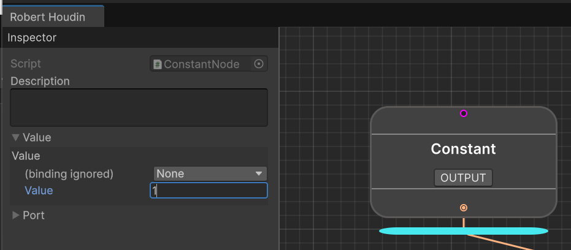

# Quick Start

## Installation

Download the latest release from [here](https://github.com/Myonmu/RobertHoudin/releases/latest), extract the source code into the **Plugins** folder of your project (if you don't have one, you need to create one). 

The ideal folder structure should look like this:

```
- Assets
   |- Plugins
        |- RobertHoudin
             |-Framework
             |-Scatter
             |- (...)
```

{: .note}
> You could actually extract it wherever you want as long as it is inside the Assets folder. But the Plugins folder is recommended.


You could delete the **Sample** folder if you want. 

{: .warning}
> It is advised to not put any of your project-specific assets in the Robert Houdin folder (including custom nodes!). Robert Houdin sometimes comes with structural adjustments in latest release and might require you to delete the existing folder. If you have anything that is not part of the plugin then you might have a hard time upgrading Robert Houdin.


### Upgrading

If you already have Robert Houdin in your project, delete the existing folder and do the previously mentioned step as if it is a fresh install.

{: .warning}
> Again, don't put anything that is not part of the plugin inside the Robert Houdin folder!


## Your First Robert Houdin Tree (`RhTree`)

The following steps demonstrate how to create a very simple RhTree: sum two numbers and print the result to the Unity console.
### Create an RhTree asset

 To create an RhTree asset, right click in your project panel and click `Create -> RobertHoudin -> RH Tree`.

An **RhTree** represents a collection of inter-connected nodes, equivalent to a network in Houdini. **Double click on an RhTree asset to open the RobertHoudin Editor**.

### Adding Nodes

In the Editor, **press space to bring up the node search window**, click on an entry to add the node to the RhTree. For now, search for **constant** and put down 2 constant nodes.


Click on a node will show a cyan bar beneath the node, which means this is the node you are inspecting. The inspector on the left of the editor will show the details of the node.


Search for **sum** and put down a **Sum Numbers** node. Connect (drag and drop) the bottom ports of the Constant nodes to the top port of the Sum Numbers node, and press the **OUTPUT** button on the Sum Numbers node.


Each node will have an **"OUTPUT"** flag, which determines when the RhTree stops evaluating nodes. This is equivalent to the render flag in Houdini. Click on the output flag will turn the flag to green, and any previously activated output flag will become grey. **There can only be one active output flag per tree**.

### Setting Values in the Inspector

Click on a Constant node, and in the inspector, expand the **Value** field, set the binding field to **None** (which will let another field appear right after it), and set the value to whatever you want. 



The value you are configuring actually corresponds to what value the *input port* will use during evaluation. And it is based on the **binding** of that port. There are three types of bindings:

- **Port** (default): the input port will use the value of the output port connected with it.
- **None**: the input port will use a constant value you provide in the inspector.
- **Property Block**: the input port will use a specific field you provide from a Property Block.

The Constant node *forwards* the value from the input port to its output port, thus the value you configured in the input port is exactly what will be fed to the next node (the sum node).

### Printing the Result

Search for **print** and put down a **Print Object** node, connect it to the output of the Sum Numbers port. Click on the OUTPUT flag on the Print Object node.


{: .hint}
> You would find two nodes when searching for "print": a **Print** and a **Print Object**. The **Print** node expects a string input, while **Print Object** can take anything. If you put down **Print** then you will unable to connect its input with the output of the Sum Numbers node.

{: .caveat}
> As of now, the edges (lines) are hard to keep straight. This is only visual and is likely related to the NodeView API which Robert Houdin has no control of. If you have an urge to keep the lines straight then I'm sorry :(

### Test Run

In the inspector of the RhTree asset, click the **Evaluate** in the context menu and you should see the summed value in the console.


And that's your first RhTree!

## Feeding Value to RhTree

It is impractical to always set the constants inside an RhTree when you need a little variation, as well as always needing to click the context menu to evaluate a tree. Robert Houdin uses **Property Blocks** to interface with your custom code.

Create a new C# script and write the following code:

```csharp
using RobertHoudin.Framework.Core.Primitives.DataContainers;  
public class SimpleRhPropertyBlock : IRhPropertyBlock  
{  
    public int value1;  
    public int value2;  
    public void OnBeginEvaluate()  
    {  
    }  
}
```

`OnBeginEvaluate` will be called whenever you evaluate a tree.  For now we do not need to do anything here. 

Create a new Game Object and add a **RhTreeRunner** component. Assign the RhTree created previously to the Tree field, and select SimpleRhPropertyBlock in the Property Block field. This will show the two value fields you declared in the property block, you could adjust the values as you like.


{: .caveat}
> Unity's support for `SerializeReference` in inspector is limited, and Robert Houdin doesn't provide any enhancement out of the box. Luckily, there are many good assets that provide decent support for `SerializeReference`. 

Now select your RhTree asset, in **Property Block Type**, select SimpleRhPropertyBlock. This data does nothing, but by doing so you will be able to see dropdown menus when selecting data sources of the ports.


Open the RhTree, change the Constant nodes' binding type to **Property Block**. You should now see that the field just before provides a dropdown, in which you can see the two fields you declared. Select value1 and value2 for the two Constant nodes respectively.


{: .hint}
> You can see the color of the port becomes red - this means the port's field binding hasn't been assigned yet. Once it is assigned, the port should turn dark gray, meaning it no longer accept output from previous nodes (even if it is still connected).

You can now change the value in Rh Tree Runner, go to the context menu and click **Execute Rh Tree**, the console will print out the sum of the values.


You can manually call `rhTree.Execute()` from code to evaluate the tree.

## Fetching Result From RhTree

Each `RhTree` exposes a result node, and you can fetch the result from result node's output ports (there can be many of them).

We will demonstrate this by printing the value ourselves.

Open the RhTree and set the output flag to the Sum Numbers node.


{: .hint}
> The Print Object node now becomes dark gray, meaning it is no longer reachable from the output node's input port, a.k.a "culled" or "pruned". A culled node will no longer be evaluated.

Create a new script and write the following code:

```csharp
using RobertHoudin.Framework.Core.Primitives;  
using RobertHoudin.Framework.Core.Primitives.Utilities;  
using UnityEngine;  
public class PrintRhTreeResult: MonoBehaviour  
{  
    public RhTreeRunner treeRunner;  
      
    [ContextMenu("Evaluate And Print")]  
    public void EvaluateAndPrint()  
    {  
        treeRunner ??= GetComponent<RhTreeRunner>();  
        treeRunner.Execute();  
        // "0" means the first output port of the result node
        Debug.Log("Print from script : " + treeRunner.GetResultValueAtPort<Number>(0));  
    }  
}
```

{: .note}
> Here, `GetResultValueAtPort` uses type `Number`, which is a generalized type for numeric operations. It is a `float` under the hood. This is to avoid writing the same node for different primitive data types. It is usually enough unless you are working with very large numbers.

Attach the component to the same object as the Rh Tree Runner, and click the **Evaluate And Print** in the component's context menu, the console should log out the message you wrote in the script with the correct sum!


And this concludes the basic usage of Robert Houdin. 

## Next Step?

If you haven't deleted the Sample folder, check it out! It contains more realistic use cases. Meanwhile, try to get familiar with the built-in nodes. When in doubt, search this documentation.

If you are interested in extending Robert Houdin, you should definitely read the **core** chapters, which goes through the details of the plugin's architecture and how to write custom ports and nodes.