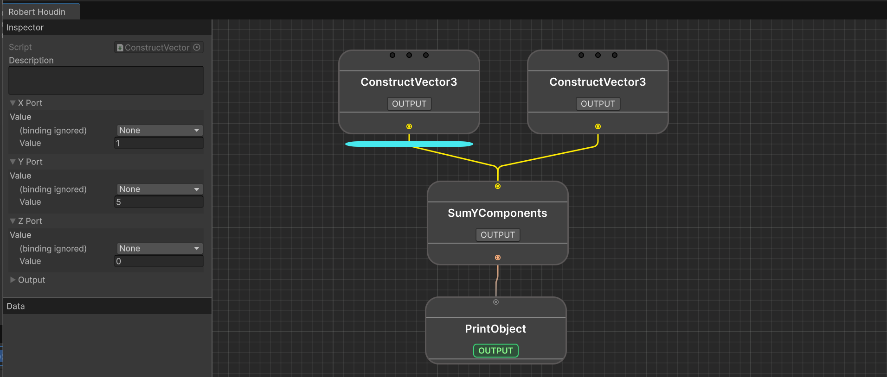

# Writing Custom Nodes

## Your First Custom Node

For this tutorial, we will be writing a custom node that takes multiple `Vector3`, and outputs the sum of their y component. 

Start by creating a new C# script and a class `SumYComponents`. Inherit the class from `RhNode` and add the required includes. Your IDE should prompt you to implement `OnEvaluate`, either implement it manually or let your IDE generate a stub for you:

```csharp
using RobertHoudin.Framework.Core.Primitives.Nodes;  
public class SumYComponents: RhNode  
{  
    protected override bool OnEvaluate(RhExecutionContext context)  
    {  
        throw new System.NotImplementedException();  
    }  
}
```

`RhNode` isn't the only node class you can inherit from, but for the majority of cases, that is enough. Other base classes are for flow control like loops and branches, we will get there later.

`OnEvaluate` is called whenever the node is traversed, and that's where you put the node's logic. But for now we do not have any data to play with, we should first declare the node's inputs and outputs.

Recall what we are aiming: the node takes multiple `Vector3`, and outputs the sum of their y components, the result is a `Number`. We need an input port that accepts an arbitrary number of `Vector3`, and an output port that outputs `Number`.

{: .hint}
> If you forgot what `Number` is, it is a `float` that can also be used as `int` and `bool`. With this you don't need to create a node for every primitive type.

Now here's the catch - in the current version of Robert Houdin, there's no port that takes multiple `Vector3` ! But that isn't hard to implement, as Robert Houdin comes with a wide range of templates (I mean generics):

```csharp
using System;  
using RobertHoudin.Framework.Core.Primitives.Nodes;  
using RobertHoudin.Framework.Core.Primitives.Ports;  
using UnityEngine;  
  
[Serializable] public class MultiVector3Port : RhMultiPort<Vector3> {}   
  
public class SumYComponents: RhNode  
{  
    [RhInputPort] public MultiVector3Port input;  
    protected override bool OnEvaluate(RhExecutionContext context)  
    {  
        throw new System.NotImplementedException();  
    }  
}
```

The `RhMultiPort<>` is the generic for making whatever that could receive multiple inputs. You don't need one for output ports, because output ports can be connected to any number of input ports by default. There is also `RhSinglePort<>` that you can use for ports that can only accept one input. 

Notice that simply declaring a port as a field is not sufficient, because Robert Houdin's reflection system doesn't know whether a field should be input or output port. Hence, you need to either use `[RhInputPort]` attribute for input ports, or `[RhOutputPort]` for outputs.

Now let's add the output port:

```csharp
using System;  
using RobertHoudin.Framework.Core.Ports;  
using RobertHoudin.Framework.Core.Primitives.Nodes;  
using RobertHoudin.Framework.Core.Primitives.Ports;  
using UnityEngine;  
  
[Serializable] public class MultiVector3Port : RhMultiPort<Vector3> {}   
  
public class SumYComponents: RhNode  
{  
    [RhInputPort] public MultiVector3Port input;  
    [RhOutputPort] public NumberPort output;  
    protected override bool OnEvaluate(RhExecutionContext context)  
    {  
        throw new System.NotImplementedException();  
    }  
}
```

Now we can tackle the actual logic. Logic in a `RhNode` typically means you consume the input ports, and put values in the output ports. Change the `OnEvaluate` method:

```csharp
protected override bool OnEvaluate(RhExecutionContext context)  
{  
    var sum = 0f;  
    input.ForEachConnected((inputVector) => sum += inputVector.y);  
    output.SetValueNoBoxing(sum);  
    return true;  
}
```

`RhMultiPort<T>` provides an easy way to iterate through all the values connected to it: `ForEachConnected(Action<T> action)`. The `action` callback which you should provide, will processes each input value. 

Setting the output value is done by calling `SetValueNoBoxing` on the output port. Why the weird method name? Because there's also a `SetValue` which accepts an `object` that requires boxing and unboxing (which is slow). So in most cases, you should always use `SetValueNoBoxing`.

`OnEvaluate` also needs to return a bool, this tells the system whether something has gone wrong during the evaluation process, and if you return `false`, then the evaluation will stop. Return `true` means "all good, proceed evaluation".

And you should now be able to find the newly created node in the search window!



## Using Single Ports

The previous example shows how to fetch values from a multi port. For single ports, we use the `GetValueNoBoxing` method. For example, the following code forwards the input number to the output:

```csharp
public class ForwardValue: RhNode  
{  
    [RhInputPort] public NumberPort input;  
    [RhOutputPort] public NumberPort output;  
    protected override bool OnEvaluate(RhExecutionContext context)  
    {  
        var inputValue = input.GetValueNoBoxing();
        output.SetValueNoBoxing(inputValue);
        return true;
    }  
}
```

## Data Source Ports

Remember you can adjust the value of a port and even bind it to a property block directly in the inspector? The previous example doesn't allow you to do that - you must feed the ports with values from other output ports.

To achieve the level of flexibility, Robert Houdin uses a concept called **Data Source**, meaning you could get data from different places, depending on the configuration.

When using `DataSource`, there are 3 different types where the data can come from:

- `None`: the value is embedded into the data source. In the editor, an extra field will appear after the type selection.
- `Port`: the value comes from evaluating the connected port.
- `PropertyBlock`: the value is retrieved from the property block in `RhExecutionContext`, using cached reflection.

Declaring a data source port is easy, just append the type name with `Ds`. If you previously used `NumberPort`, then changing it to data source port is simply using `NumberPortDs`. Take the previous `ForwardValue` example:

```csharp
public class ForwardValue: RhNode  
{  
    [RhInputPort] public NumberPortDs input;  
    [RhOutputPort] public NumberPort output;  
    protected override bool OnEvaluate(RhExecutionContext context)  
    {  
        var inputValue = input.GetValueNoBoxing();
        output.SetValueNoBoxing(inputValue);
        return true;
    }  
}
```

Now, what if you want to create a new data source port type? - Simply use the `RhDataSourcePort<T>` generic:

```csharp
[Serializable] public class Vector3PortDs: RhDataSourcePort<Vector3> { }
```

{: .note}
> You can name the port however you like, but the built-in implementation always end a port class by `Port` and a data source port by `PortDs`
